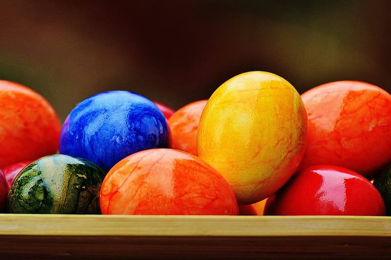
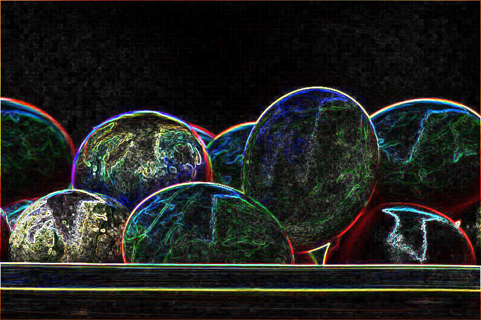
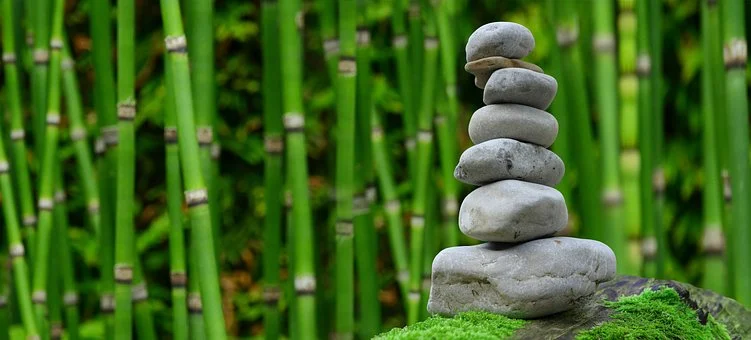
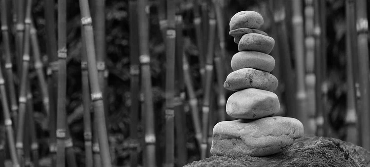

A command-line tool for apply filters to images. 

## Available Filters
* Blur
* Grayscale
* Edge-Detection
* Reflect
* Sepia

## Supported Image Types
Currently, only BMP 24-bit format is supported.

## Usage
```sh
    $ filter [-flag] infile outfile
    flag:
    -b  Blur image
    -g  Convert image into black and white format
    -e  Detect edges in an image
    -r  Image in front of a mirror
    -s  Give image an old-timey feel
```

## Examples
* Detecting Edge
```sh
    $ filter -e marble.bmp marble-edges.bmp
```
<p align="center">
  
   
</p>

* Applying grayscale
```sh
    $ filter -g stone.bmp stone-bw.bmp
```
<p align="center">
  
   
</p>
